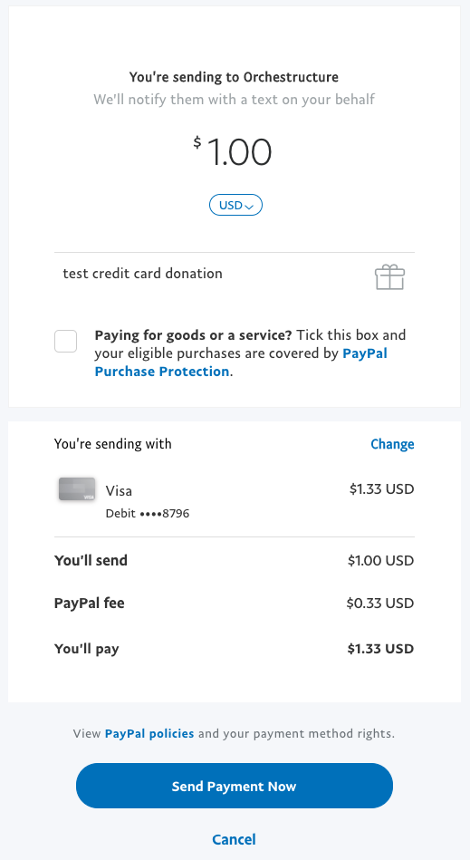

## Sponsoring Orchestructure

      

While [Orchestructure](orchestructure.io) is made up of amazing attendees who [provide](https://github.com/orchestructure/presentations) ideas, insight,
and expertise, we still need awesome Sponsors to keep the group running smoothly.

Most of our expenses revolve around planning, meeting, online resources and other miscellaneous expenses. We accept all common payment options (check, ach, paypal, etc..)

> Orchestructure is a **non-profit** organization! 

We provide three distinct tiers for Sponsors to give. They are meant to be flexible
and fair to both the sponsors and meeting attendees. In addition, we
also have other options for smaller organizations or individuals who want
to give to Orchestructure. If for some reason, you'd like to contribute but don't
see a fitting option here, feel free to open an issue!

Think you're ready to pull the trigger? [Sign up](https://goo.gl/forms/fOcP6A70fXWy21Ft2) or straight to [Paypal]((https://paypal.me/orchestructure))!

### Paying with PayPal

You'll be able to utilize your Paypal account to pay with a bank account, credit card, or paypal balance.

1. Go to https://paypal.me/orchestructure and enter the amount you wish to donate.
2. Login and select your payment method.
3. **Uncheck** the "*Paying for a goods or service?*" box!
4. Verify the transaction and click "*Send Payment Now*"
5. Thank you so much for your donation; We'll be reaching out!

### Exmaple of Donation via PayPal:

## Levels of Sponsorship

> Please note that prices listed are *yearly*, **not** monthly! Yes, it's that cheap!

### Gold

**$2000/yr** or more. Items like swag or discounted offerings are encouraged.

#### Includes

* Mention at every meeting or event with listing on our main [site](htts://orchestructure.io/) and [Meetup](https://www.meetup.com/orchestructure/)
* Swag distribution at any meeting you'd like
* One [presentation](https://github.com/orchestructure/presentations) (or 2 [Lightning Talks](https://github.com/orchestructure/presentations#lightning-talks)) each year around your offering
* Retweet/Mention on [Twitter](https://twitter.com/orchestructure)
* Your logo on our t-shirts and other Orchestructure swag
* A warm, fuzzy feeling!

### Silver

**$1000/yr** or more. Items like swag or discounted offerings are encouraged.

#### Includes

* Mention at every meeting; Listing on [Meetup](https://www.meetup.com/orchestructure/) Page
* Retweet/Mention on [Twitter](https://twitter.com/orchestructure) bi-monthly
* 2 [Lightning Talks](https://github.com/orchestructure/presentations#lightning-talks) at any time each year
* Swag distribution at 2 meetings each year
* A warm, fuzzy feeling!

### Bronze

**$500/yr** or more. Items like swag or discounted offerings are encouraged.

#### Includes

* Mention at every meeting
* 1 [Lightning Talk](https://github.com/orchestructure/presentations#lightning-talks) at any time each year
* Swag distribution at 1 meeting each year
* A warm, fuzzy feeling!

### One-Time Mention

Either through monetary donation or providing the refreshments at a future meeting, individuals and small organizations can support the group. You'll get mentioned (and can provide swag etc) at the meeting following your contribution.
